# Share images (Open Graph)

Back to the [website skill](SKILL.md).

This file is the one standard for Shantara share images: the picture that appears when a page is shared on WhatsApp, LinkedIn, Facebook, X, iMessage or email. It covers what the preview must say so someone taps it, what the image looks like, what it may contain, the three templates, the page metadata that feeds them, how Astro generates them at build time, when a manual image is allowed, and how to check the result.

The checkable rules are SOCIAL-01 to SOCIAL-04 in [search-visibility/social.md](search-visibility/social.md). They point here for the detail. The reference renderer is [`templates/og-images/og-image.mjs`](../../templates/og-images/og-image.mjs); it implements this file, and when the two disagree this file wins and the renderer is corrected.

| Rule already recorded | Where |
| --- | --- |
| One metadata generator per page type (DATA-03) | [search-visibility/data.md](search-visibility/data.md) |
| `og:site_name` is "Shantara Naturopathy Retreat" | [skill-technical.md](skill-technical.md#global-site-identity-titles-and-open-graph) |
| Three heroes and where each is used | [`HeroFullBleed.prompt.md`](../../components/sections/HeroFullBleed.prompt.md) |
| Diodrum, the Light rule, no eyebrows | [skill-premium.md](skill-premium.md#design-system-rules-from-the-brand-deck) |
| Logo colourways, never on bare photography | [`guidelines/logo.html`](../../guidelines/logo.html) |
| Rosette band proportions | [`tokens/pattern.css`](../../tokens/pattern.css) |
| Guest privacy in photographs | Root [`SKILL.md`](../../SKILL.md) |
| Where photographs are stored and what may sit in `public/` | [skill-images.md](skill-images.md) |
| Claim words banned in Open Graph text (MED-03) | [search-visibility/medical.md](search-visibility/medical.md) |
| No rates outside the tariff page | [search-visibility/rates.md](search-visibility/rates.md) |

## 1. What a Shantara share image is

**A share image is the page's hero, reduced to 1200 × 630.** The website has exactly three heroes, so there are exactly three share templates. Each uses the same ground, photograph, type and marks as its hero. There is no separate social-media style.

Every share image carries the same three things, and nothing else:

1. The Shantara wordmark, top left.
2. The page title, large, in Diodrum Light. It is the dominant element.
3. One supporting line, only when it fits whole.

The text sits on the bottom of the safe area in all three templates, so a feed of Shantara links reads as one family.

## 2. What the preview must say

The information architecture in [skill-ia.md](skill-ia.md) says what each URL is for. The share preview has to say that in the picture, because X and iMessage often hide `og:description`. WhatsApp, Facebook and LinkedIn print `og:title` again under the image, so the supporting line must add a fact the title does not already say.

Reference copy for every fixed page, and the headline maps for programmes, articles and Doctor Answers, live in [`templates/og-images/share-copy.mjs`](../../templates/og-images/share-copy.mjs). This section is the standard. If the file and this section disagree, this section wins.

### Platforms

WhatsApp is the preview that matters: the public number is a WhatsApp number, and the India and GCC paths travel as forwarded chats. Design the image for WhatsApp at the full 1.91:1 frame.

| Platform | What the person sees | What has to carry the message |
| --- | --- | --- |
| WhatsApp | Image, then bold `og:title`, then about two lines of `og:description`, then the domain | Image and description. The title is repeated under the image. |
| Facebook, LinkedIn | Image, then title, then a short description | Same. Description is often cut near 100 characters. |
| X, iMessage | Image and `og:title`. The description is often hidden. | The image alone: wordmark, one-line title, supporting line. Doctor Answers have no supporting line, so the title is the whole pitch. |

The title is set in 64 px up to 32 characters, then smaller. Thirty-two characters is the type-size step, not a guarantee of one line. The programme column and the editorial column wrap before that, so a headline that wraps leaves a first line that is not the whole thought. Write the headline so it stays on one line in its template (the samples are the check). A centre square crop cuts the left of the bottom line. The title stays where the templates put it; moving it would be a fourth layout. One line is the mitigation that does not change the templates.

### Search text and share text

| Field | Job |
| --- | --- |
| `title`, `meta_title` | Search and the document `<title>`. May be longer. May be a catalogue name. |
| `description`, `meta_description` | Search meta description. |
| `og.title` | Picture headline and `og:title`. Set it whenever the search title is a nav label, a keyword, a search qualifier, or an outcome. |
| `og.description` | Supporting line on the image, and the text beside the image. It adds a fact. It does not repeat the headline. |

Doctor Answers set `og.line: false`. The picture is the headline only. `og:description` still names that a Shantara doctor answers on the page. Use `short_answer` there only when it passes the claim and rate checks and can be read with no caveats. There is no new field for this.

### URL families

Jobs are the families in [skill-ia.md](skill-ia.md). The template is still the page's hero.

| Family | Template | Picture headline | Supporting line |
| --- | --- | --- | --- |
| Home | `default` | A doctor-led stay in Keralam | Every stay begins with a doctor's consultation. |
| Conditions index | `editorial` | Conditions we see | Your doctor plans the stay after consultation. |
| Condition detail | `programme` | The condition's name, when it fits one line | A residential stay in Keralam, after consultation. |
| Programmes index | `editorial` | Programmes for a stay | Each programme follows a consultation. |
| Programme detail | `programme` | The programme name, when it fits one line and does not state an outcome | Who it is for, from `proposition`, or "A doctor-supervised residential stay." |
| Therapies | `default` | Therapies during a stay | Your doctor recommends them after consultation. |
| Rooms | `default` | Rooms for the stay | Quiet rooms at the retreat in Keralam. |
| Amenities | `default` | The grounds of the retreat | Shared rooms and time on the grounds. |
| Farm and dining | `default` | Meals during the stay | Your doctor plans them with the programme. |
| A day at Shantara | `default` | A day at the retreat | An example day. Each stay is planned. |
| Our Story | `editorial` | How Shantara began | Founded from Hygiene Nature Cure Hospital. The parent hospital appears only here. |
| Our Approach | `editorial` | How a stay is planned | Consultation, the stay, then going home. |
| Our Doctors | `editorial` | The doctors at Shantara | Qualifications, practice and how to consult. |
| Doctor profile | `programme` | The doctor's name | Qualification, or the role if there is no qualification. |
| Journal index | `editorial` | Notes from the retreat | Guides, doctors' answers and guest accounts. |
| Article | `editorial` | The article title, or a shorter `og.title` when that title wraps | `lead`, or `category` when the lead is missing or is a placeholder. |
| Doctor Answer | `editorial` | A one-line form of the question | None on the image. `og:description` says a doctor answers on the page. |
| Ayurveda and naturopathy | `editorial` | Ayurveda and naturopathy | How the two practices differ. No record yet, so nothing is generated. |
| Medical Editorial Policy | `editorial` | How we review health pages | Who writes, who reviews, what we will not claim. No route yet, so nothing is generated. |
| Tariff | `programme` | The tariff card | Rooms, inclusions, payment and cancellation. No amount. |
| FAQ | `editorial` | Questions before a stay | Booking, who can stay, and the days here. |
| Contact | `editorial` | Speak with the retreat | Call, WhatsApp or email from Keralam. No phone number. |
| Book a Consultation | `programme` | Book a consultation | A doctor helps you choose the next step. |
| Resident policies | `editorial` | During your stay | House rules for life at the retreat. |
| Cancellation | `editorial` | If a stay is cancelled | How a change or a cancellation is handled. |
| Privacy | `editorial` | Privacy at the retreat | What we collect, and why we keep it. |
| Terms | `editorial` | Terms for this website | The terms that cover using the site. |

Condition names stay the guest's need (`Obesity`, `PCOS`, `Diabetes`), not a clinic-intent query. PCOS is not written as a local holistic-treatment offer. `Low back / neck pain` wraps in the programme column, so its picture headline is `Back and neck pain`. A programme whose name states an outcome (`Diabetes Reversal`, `Complete Healing`, and the same class of name) keeps that name as the search title and uses a descriptive `og.title` (`A diabetes stay`, `Several conditions`). The picture does not say reversal, healing, cure or guarantee.

An article's `category` is the subtype (Clinical Guide, Guest Story, Food & Recipes, and the rest). It is the supporting line only when `lead` cannot be used. It is not a label above the title.

### Writing rules

- The headline's first line is the whole headline. If it wraps, shorten `og.title`. Do not truncate.
- The supporting line is present on every indexable page except Doctor Answers.
- The supporting line does not repeat the headline, quote a rate, or state a duration.
- Search may keep a longer title. The picture uses `og.title`.
- Copy follows [skill-copy.md](skill-copy.md). No "patients". No "wellness retreat". "Nature cure" only inside Hygiene Nature Cure Hospital, and only on Our Story.

## 3. The three templates

| Template | Mirrors | Ground | Used for |
| --- | --- | --- | --- |
| `default` | `HeroFullBleed` | Full-bleed photograph, `--scrim-hero` behind the text, `--scrim-header` behind the wordmark | Home; the Experience pages (`/en/therapies`, `/en/rooms`, `/en/amenities-activities`, `/en/farm-dining`, `/en/a-day-at-shantara`); any page that sets no template |
| `programme` | `HeroSplit` | Merino text column, photograph on the right at 40% of the width | Programme and condition detail pages, doctor profiles (`/en/doctors/{slug}`), Tariffs, Book a Consultation |
| `editorial` | `HeroStatement`, `ArticleHeader` | Merino, rosette band on the right edge | Conditions and Programmes indexes; About pages (Our Story, Our Approach, Our Doctors, Medical Editorial Policy); the Journal index; every Journal entry (articles, Clinical Guides, Evidence Notes, Doctor Answers, Guest Stories); FAQ, Contact and the policy pages |

**The template follows the page's hero.** A page type not listed here uses the template that matches its hero. Do not add a fourth template; a page that seems to need one uses the closest of the three.

**Pages with no generated image.** Journal pagination (`/en/journal/2` onwards) is `noindex` and uses `og-default.jpg`, like every other noindex page (section 7).

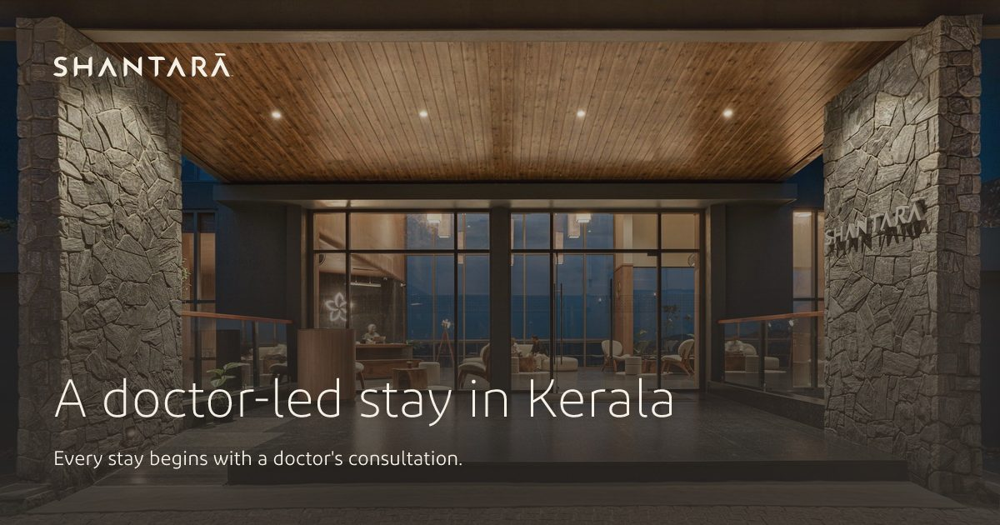

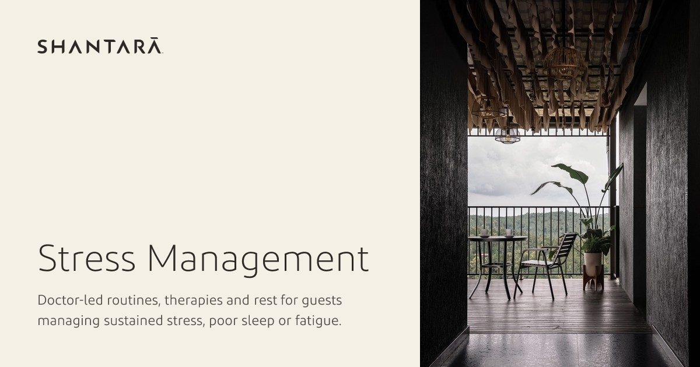

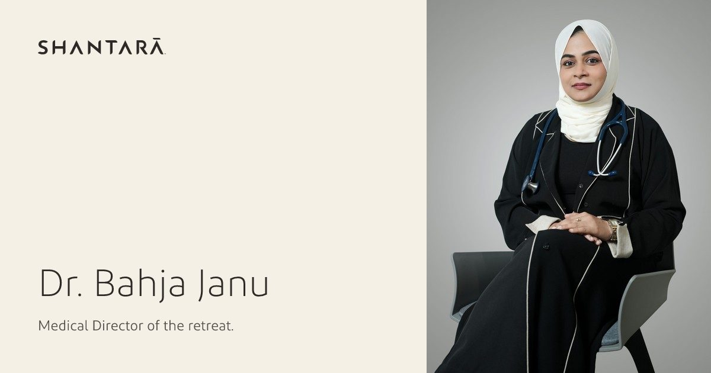

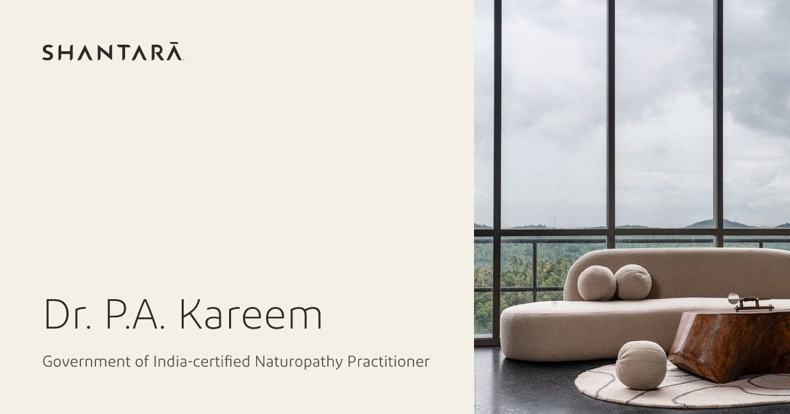

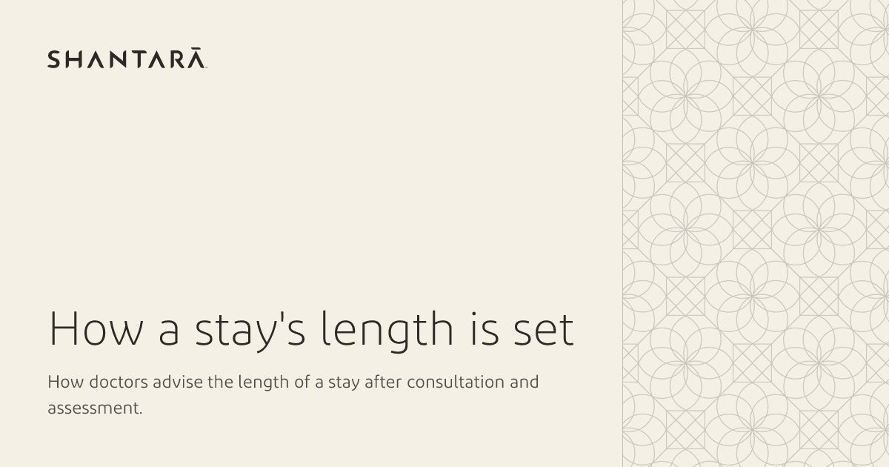

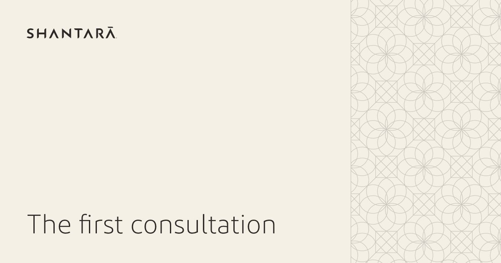

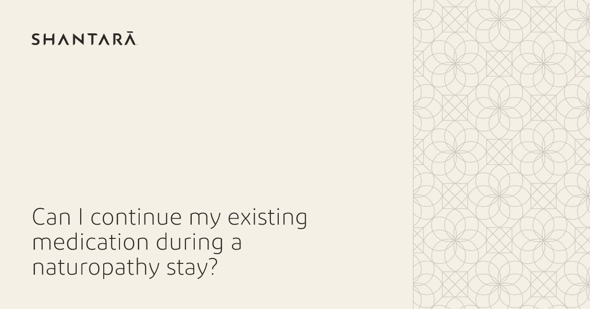

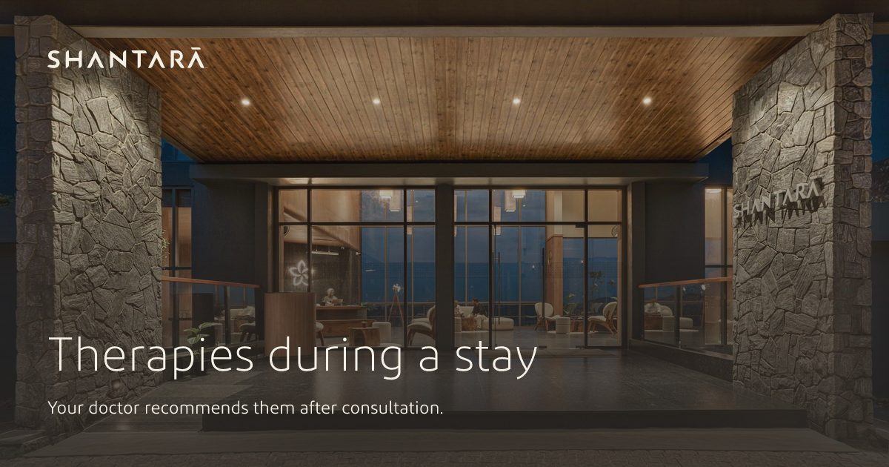

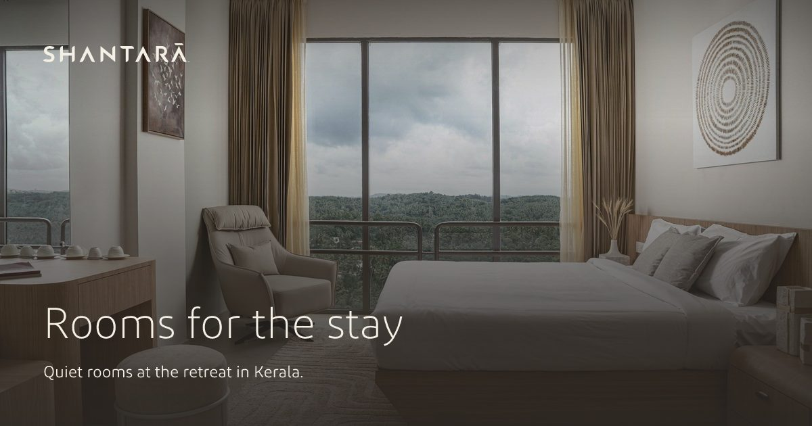

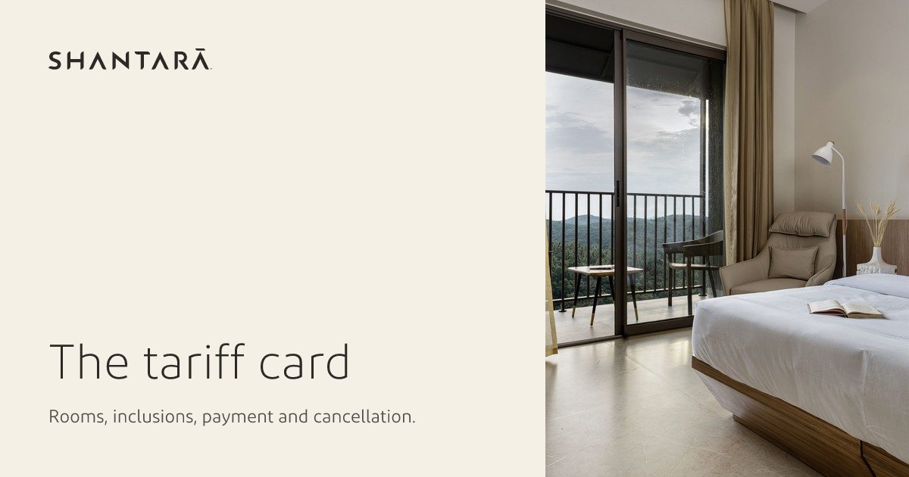

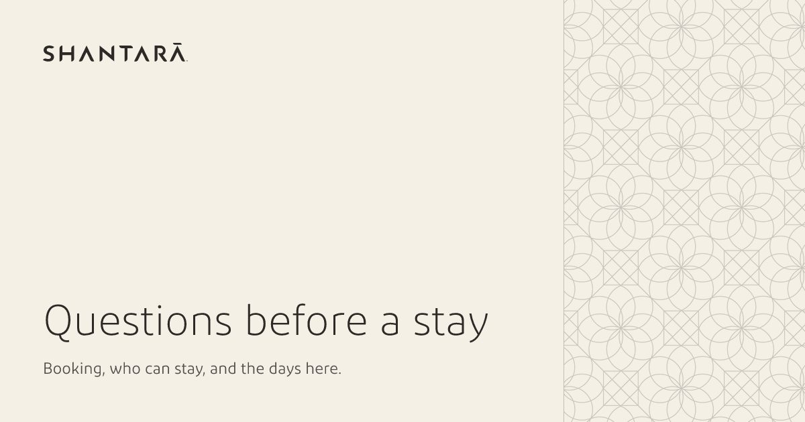

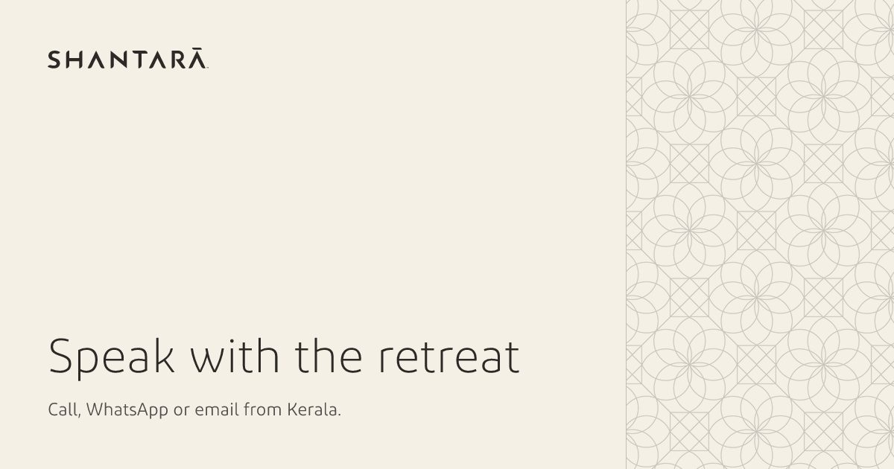

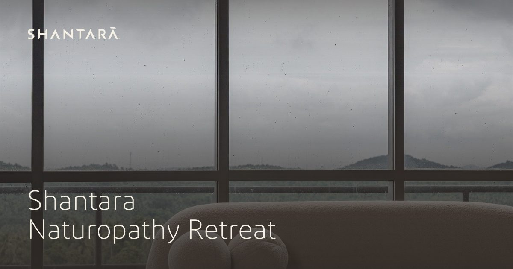

The samples are generated from `content/` records by [`templates/og-images/render-samples.mjs`](../../templates/og-images/render-samples.mjs). `og-default.jpg` is the approved global default and is copied to the website unchanged.

## 4. Layout, type and colour

All values are design-system tokens. The renderer resolves them to literals because it cannot read CSS; the token names sit beside each value in `og-image.mjs`.

| Element | Value |
| --- | --- |
| Canvas | 1200 × 630 px |
| Safe area | 64 px inset on all four sides (`--space-11`). The wordmark and all text stay inside it. Photographs and the rosette band bleed to the edges. |
| Wordmark | `wordmark-cream.svg` on the photograph, `wordmark-dark.svg` on Merino. 216 px wide, top left of the safe area. Never the full lockup or the mark alone. |
| Title | Diodrum Light 300, line height 1.06 (`--leading-tight`), balanced wrapping, left-aligned. 64 px up to 32 characters, 56 px up to 60, 48 px above that (`--text-5xl` → `--text-4xl`). |
| Supporting line | Diodrum Regular 400, 24 px (`--text-xl`), line height 1.45, 24 px below the title (`--space-7`). |
| Ink on photograph | Solid Merino for title and line. Never Gold, never a faded Merino mix. |
| Ink on Merino | Pine Tree title (about 12.7:1). `--text-secondary` line (about 7.5:1). |
| Programme photograph | 480 × 630, square-cut, no scrim. Text column 600 px wide. |
| Editorial band | 360 px (30%, `--pattern-band-md`) on the right edge. Cell 180 px (band ÷ 2). Cotton Seed ink at 0.9 and a 1 px Cotton Seed hairline on the inner edge. Text column 712 px wide. |
| Right-to-left | The layout mirrors: wordmark top right, text right-aligned, the programme photograph and the editorial band on the left. The wordmark itself is not mirrored. Type follows `tokens/rtl.css`: IBM Plex Sans Arabic first, then Diodrum; title line height 1.25, supporting line 1.7. Arabic is not enabled yet (section 12). |

### Fitting the copy

Share previews are small: a 1200 px image is often shown about 500 px wide. Nothing on the image is smaller than 24 px, and the copy is kept short rather than shrunk.

| Template | Longest title (three lines) | Supporting line shown when it is at most |
| --- | --- | --- |
| `default` | 90 characters | 110 characters (two lines) |
| `programme` | 60 characters | 140 characters (three lines) |
| `editorial` | 72 characters | 100 characters (two lines) |

- A title over the limit **fails the build** with a message naming the page. Set a shorter `og.title`. Never let the renderer truncate. `meta_title` stays the search title.
- A picture headline over 32 characters fails the copy audit unless `og.title` is set. Set `og.title` so the headline also stays on one line in that template. The 32-character step only selects 64 px type. The programme and editorial columns wrap sooner (section 2).
- The supporting line is shown whole or not at all. It is never cut with an ellipsis.
- A title longer than 60 characters takes the space, so its supporting line is dropped. `long-title.jpg` is a layout fixture for that wrap. It is not the share headline of that Doctor Answer.
- **Doctor Answers never carry a supporting line**, whatever its length (`og.line: false`). A one-line clinical answer on the picture, read without its caveats, is a health claim waiting to happen. `og:description` names that a doctor answers on the page. `short_answer` is used there only when it passes the claim and rate checks.
- The limits are character counts measured against Diodrum. They hold for English, German, French and Russian; German and French titles run longer, so expect to shorten more of them. They have not been measured for Arabic (section 12).

## 5. Photography

- **Use the page's own photograph.** Fixed pages use their hero. Entries use `featured_image`, which is already the photograph editors choose for the page ([skill-content.md](skill-content.md#shared-fields)). Doctor profiles use `photo_profile`. Pages with no photograph use `site/valley.jpg`.
- **Photographs always come from the English entry.** Translated files carry text only ([skill-content.md](skill-content.md#languages)), so a translated page's share image uses the same photograph as the English one.
- **Guest privacy applies unchanged.** Prefer frames without `-guest` in the name ([`assets/photos/README.md`](../../assets/photos/README.md)). Never treatment in progress, faces in therapy or room numbers.
- **For the `default` template, choose a frame whose lower left is quiet and fairly dark.** The scrim protects contrast, but a bright sky or white wall behind the title still reads badly at preview size.
- The crop is centred. If the subject falls out of a 1.9:1 or 0.76:1 crop, choose another frame.
- Real Shantara photography only. No stock, no filters or colour grades, and no AI-generated images of the place, rooms, food, therapies, guests or doctors (IMG-06).
- The rosette band appears only on the `editorial` template, on Merino. Never put it over a photograph in a share image.

## 6. Never on a share image

- A URL or domain name. The platform prints it beside the image.
- A button, "Book now", "Learn more" or any other call to action.
- Rates, prices, "from …", offers or discounts. Rates appear only on the tariff page.
- Durations, dates, author or reviewer names. The page shows them where they can be read and checked (MED-01, MED-05).
- An eyebrow, label or category above the title.
- Badges, icons, emoji, a phone number or a second logo.
- Accent colours, Gold text, drop shadows, gradients other than the two scrims, or rounded corners.
- Health claims. MED-03 already covers Open Graph text, and the image repeats that text.

## 7. Page metadata

Share images are generated from the page metadata the site already builds for `<title>`, the meta description and the canonical URL (DATA-03). Keystatic holds no share-image fields. `title` and `meta_title` remain the search title. `og.title` and `og.description` are the preview, from section 2. Editors still change the picture by editing the title, the lead or proposition, and the featured image. A search title that reads badly as a headline is overridden in the generator, not with a new field.

```ts
type PageMeta = {
  locale: EnabledLocale; // 'en'; sets og:locale, the image direction and the default image
  path: string;          // canonical route: '/en/', '/en/programs/stress-management'
  title: string;         // page title without the brand suffix
  description?: string;  // meta description; a fixed page without one is noindex
  noindex?: boolean;
  alternates?: EnabledLocale[]; // other locales where this page is published → og:locale:alternate
  og?: {
    title?: string;       // defaults to title
    description?: string; // defaults to description
    template?: 'default' | 'programme' | 'editorial'; // defaults to 'default'
    photo?: string;       // project-relative JPEG, e.g. 'src/assets/images/site/arrival-dusk.jpg'
    line?: boolean;       // false keeps the supporting line off the image; og:description is unchanged
    image?: string;       // manual override in public/, e.g. '/og/monsoon-2027.jpg' (section 9)
    imageAlt?: string;    // required with image
  };
};
```

**Copy falls back to the page:**

```text
search title       = title                         (meta_title for entries)
search description = description                   (meta_description for entries)
share title        = og.title       ?? title
share description  = og.description ?? description
image headline     = share title
image line         = share description, unless og.line is false
```

The document `<title>` uses the search title plus the brand suffix. `og:title` uses the share title. The meta description uses the search description. `og:description` uses the share description. X reads `og:title` and `og:description`, so the site writes no `twitter:title` or `twitter:description`. On a Doctor Answer the image line is omitted and `og:description` is still written.

**The image falls back in three steps:**

```text
og.image set              → that file (a manual override)
indexable page            → /open-graph/<path>.jpg, generated at build
noindex page, or anything
the generator does not    → the locale's default: /og-default.jpg for English,
cover                       /og-default-{locale}.jpg for any other enabled locale
```

**Set `og.title` and `og.description` on every indexable commercial and journal page.** The generator sets `template` and `photo` as well, and `line: false` for Doctor Answers. `og.title` is required when the search title is a nav label, a keyword, a qualifier, an outcome, or longer than one line in the template. `og.description` is the extra fact. It is not a shortened copy of the meta description unless that shorter line adds something the headline does not say.

**Languages.** Each published translation is its own page with its own `PageMeta`, so `/ar/journal/{slug}` would get `/open-graph/ar/journal/{slug}.jpg`. Title and description come from the translated file; the photograph comes from the English entry. A translation counts only when both it and its English master are `published`. No published translation means no page, no share image and no `og:locale:alternate` for that language. Never generate images for a locale that is not enabled.

**Default image per language.** Each enabled locale other than English needs its own `public/og-default-{locale}.jpg`, rendered with the same `default` template from that locale's `site/{locale}.json` business name, so a noindex page never falls back to an English card. Render it in the localisation project that enables the locale, not before.

## 8. Astro implementation

### How it works

```text
page metadata (PageMeta, one generator per page type, per enabled locale)
      │
      ├── page routes: getStaticPaths() comes from the same lists
      │
      ├── <Head meta> (components/seo/Head.astro): title, description, canonical,
      │   robots, og:*, og:locale, og:image:*, twitter:card, twitter:image
      │
      └── src/pages/open-graph/[...route].ts
            getStaticPaths() lists every indexable page
            GET renders one JPEG per page with og-image.mjs
                  ↓
astro build → dist/*.html + dist/open-graph/**/*.jpg → Netlify CDN
```

Everything is rendered once, during `astro build`. There is no server, function or edge code for share images, and the site stays fully static. Pages change only on deploy, so runtime rendering would add cost and cold starts for nothing.

### Libraries

| Option | Decision |
| --- | --- |
| **satori + sharp** | **Used.** satori lays out the template (flexbox, balanced wrapping, CSS masks) with the Diodrum TTFs and returns SVG. sharp, which Astro already installs for its image pipeline, crops the photograph and writes the JPEG. satori is the only new dependency. |
| astro-og-canvas | Not used. Its layout is fixed: a raster logo, then title and description stacked from the top. It cannot draw a scrim over the photograph, a split layout or the rosette band, so every page would get a generic blog card. |
| `@vercel/og`, a Netlify Function or an Edge Function | Not used. These render on request. Shantara has no data that changes between deploys. |
| A plain 1200 × 630 crop of the hero with `getImage()` | Replaced. It carried no title or brand, so shares of different pages looked alike. |

Verified in shantara.life with Astro 7.3, Keystatic 0.5, satori 0.33 and sharp 0.35: `astro check`, `astro build`, `check-routes.mjs`, `check-content.ts` and the check in section 10 pass. When building on a newer release, check `getStaticPaths`, `import.meta.env.SITE` and the Keystatic reader's return values against the installed version before copying the code below.

### Files

```text
src/
  components/seo/Head.astro        ← the only place share tags are written
  layouts/BaseLayout.astro         ← takes `meta: PageMeta`; sets html lang and dir from meta.locale
  lib/
    i18n.ts                        ← ENABLED_LOCALES, OG_LOCALES, localeDir()
    seo/
      meta.ts                      ← PageMeta, resolveMeta(), ogImagePath(), ogDefaultImage(), photoPath()
      pages.ts                     ← FIXED_PAGES, one xxxPaths() per page type, getAllPageMeta()
        og/
        og-image.mjs               ← copied unchanged from templates/og-images/
        share-copy.mjs             ← copied from templates/og-images/; headlines and auditSharePage
        DiodrumCyrillic-Light.ttf  ← from assets/fonts/ (satori cannot read WOFF2)
        DiodrumCyrillic-Regular.ttf
        wordmark-cream.svg, wordmark-dark.svg, pattern-unit.png   ← from assets/
  pages/open-graph/[...route].ts   ← one JPEG per indexable page
public/
  og-default.jpg                   ← templates/og-images/samples/og-default.jpg
  og/                              ← manual overrides only (section 9)
scripts/check-og.mjs               ← copied from templates/og-images/check-og.mjs (section 10)
```

The IBM Plex Sans Arabic TTFs (`assets/fonts/IBMPlexSansArabic-{Light,Regular}.ttf`, with `IBMPlexSansArabic-OFL.txt`) are copied into `src/lib/seo/og/` and passed to `loadOgAssets()` as `fontArabicLight` and `fontArabicRegular` only when Arabic is enabled (section 12).

Add `satori` to `dependencies`. `astro.config.mjs` sets `site: 'https://shantara.life'`; nothing else in the code base writes the domain.

`src/pages/open-graph/` is the one folder allowed beside `[locale]/`, and it holds only `[...route].ts`. It serves images, not pages. `check-routes.mjs` enforces both ([skill-structure.md](skill-structure.md#build-checks)).

### `src/lib/seo/meta.ts`

```ts
import { OG_LOCALES, localeDir, type EnabledLocale } from '../i18n.ts';

export type OgTemplate = 'default' | 'programme' | 'editorial';

export type PageMeta = {
  locale: EnabledLocale;
  path: string;
  title: string;
  description?: string;
  noindex?: boolean;
  alternates?: EnabledLocale[];
  og?: {
    title?: string;
    description?: string;
    template?: OgTemplate;
    photo?: string;
    line?: boolean;
    image?: string;
    imageAlt?: string;
  };
};

export const SITE_NAME = 'Shantara Naturopathy Retreat';
export const OG_DEFAULT_PHOTO = 'src/assets/images/site/valley.jpg';

export const ogDefaultImage = (locale: EnabledLocale) => (locale === 'en' ? '/og-default.jpg' : `/og-default-${locale}.jpg`);

export const ogImagePath = (path: string) => `/open-graph/${path.replace(/^\/|\/$/g, '') || 'index'}.jpg`;

/** Project-relative path of a Keystatic image field, which stores it from the project root. */
export const photoPath = (src: string | null | undefined) => src?.replace(/^\//, '') || undefined;

export function resolveMeta(page: PageMeta, site: URL) {
  const { og = {} } = page;
  if (og.image && !og.imageAlt) throw new Error(`${page.path}: og.image needs og.imageAlt`);
  const title = og.title ?? page.title;
  const description = og.description ?? page.description;
  const generated = !og.image && !page.noindex;
  const image = og.image ?? (generated ? ogImagePath(page.path) : ogDefaultImage(page.locale));
  return {
    documentTitle: page.title === SITE_NAME ? SITE_NAME : `${page.title} | ${SITE_NAME}`,
    description: page.description,
    canonical: new URL(page.path, site).href,
    noindex: page.noindex ?? false,
    lang: page.locale,
    dir: localeDir(page.locale),
    ogLocale: OG_LOCALES[page.locale],
    ogLocaleAlternates: (page.alternates ?? []).map((l) => OG_LOCALES[l]),
    og: {
      title,
      description,
      line: og.line === false ? undefined : description,
      generated,
      template: og.template ?? 'default',
      photo: og.photo ?? OG_DEFAULT_PHOTO,
      image: new URL(image, site).href,
      imageAlt: og.imageAlt ?? (generated ? title : SITE_NAME),
    },
  };
}
```

Keystatic image fields store the path from the project root (`/src/assets/images/programs/…`, [skill-images.md](skill-images.md#keystatic-image-fields)), and the reader returns it unchanged, so `photoPath()` only drops the leading slash. Empty Keystatic text fields read as `""`, so the generators below fall back with `||`.

`src/lib/i18n.ts` holds the locale facts the metadata needs:

```ts
export const ENABLED_LOCALES = ['en'] as const;
export type EnabledLocale = (typeof ENABLED_LOCALES)[number];

/** `og:locale` value per enabled locale (language_TERRITORY). */
export const OG_LOCALES: Record<EnabledLocale, string> = { en: 'en_IN' };

const RTL_LOCALES: readonly string[] = ['ar'];
export const localeDir = (locale: string): 'ltr' | 'rtl' => (RTL_LOCALES.includes(locale) ? 'rtl' : 'ltr');
```

### `src/lib/seo/pages.ts`

One list feeds the page routes, `<Head>` and the image route, so a page cannot have a share tag without an image. Content is read through the Keystatic reader ([skill-structure.md](skill-structure.md#reading-content)); there are no Content Collections.

```ts
import { reader } from '../content.ts';
import { ENABLED_LOCALES, type EnabledLocale } from '../i18n.ts';
import { DOCTOR_PROFILES, resolveRoute, type FixedPageKey } from '../routes.ts';
import { photoPath, type PageMeta } from './meta.ts';

type FixedKey = 'home' | FixedPageKey;
type FixedPage = Pick<PageMeta, 'title' | 'description' | 'og'>;

/** Fixed-page SEO copy per locale. A page without a description stays noindex until its copy is written. */
const FIXED_PAGES: Record<EnabledLocale, Record<FixedKey, FixedPage>> = {
  en: {
    home: {
      title: 'A doctor-led naturopathy retreat in Keralam',
      description: 'Shantara is a doctor-led naturopathy retreat in Keralam. Every stay begins with a consultation.',
      og: {
        template: 'default',
        title: 'A doctor-led stay in Keralam',
        description: "Every stay begins with a doctor's consultation.",
        photo: 'src/assets/images/site/arrival-dusk.jpg',
      },
    },
    therapies: {
      title: 'Therapies during a residential stay',
      description: 'Therapies at Shantara are recommended by your doctor after consultation, as part of the stay.',
      og: {
        template: 'default',
        title: 'Therapies during a stay',
        description: 'Your doctor recommends them after consultation.',
      },
    },
    rooms: {
      title: 'Rooms for a residential stay',
      description: 'Rooms at the retreat in Keralam, for guests on a doctor-planned residential stay.',
      og: { template: 'default', title: 'Rooms for the stay', description: 'Quiet rooms at the retreat in Keralam.' },
    },
    // faq, contact, tariff, both doctor profiles and every other fixed page: section 2
    // tariff picture headline is "The tariff card", not "Tariff"
  },
};

export function fixedMeta(key: FixedKey, locale: string): PageMeta {
  const l = locale as EnabledLocale;
  const page = FIXED_PAGES[l]?.[key];
  if (!page) throw new Error(`No "${key}" page for locale "${locale}"`);
  return {
    ...page,
    locale: l,
    path: key === 'home' ? `/${l}/` : resolveRoute('page', key, l),
    noindex: !page.description,
    alternates: ENABLED_LOCALES.filter((other) => other !== l && FIXED_PAGES[other]?.[key]),
  };
}

/** Journal listing. Page 2 onwards keeps its own canonical but is noindex. */
export function journalMeta(locale: string, page: number): PageMeta {
  const meta = fixedMeta('journal', locale);
  return page > 1 ? { ...meta, path: `${meta.path}/${page}`, noindex: true } : meta;
}

type Localized<E> = { locale: EnabledLocale; slug: string; entry: E; master: E; alternates: EnabledLocale[] };

/** Published entries in every enabled locale. A translation counts only when its English master is published; photos come from the master. */
async function published<E extends { status: string }>(
  read: (locale: EnabledLocale) => Promise<{ slug: string; entry: E }[]>,
): Promise<Localized<E>[]> {
  const byLocale = await Promise.all(
    ENABLED_LOCALES.map(async (locale) => ({
      locale,
      entries: (await read(locale)).filter((e) => e.entry.status === 'published'),
    })),
  );
  const master = new Map(byLocale.find((l) => l.locale === 'en')!.entries.map((e) => [e.slug, e.entry]));
  const localesOf = (slug: string) => byLocale.filter((l) => l.entries.some((e) => e.slug === slug)).map((l) => l.locale);
  return byLocale.flatMap(({ locale, entries }) =>
    entries
      .filter((e) => master.has(e.slug))
      .map(({ slug, entry }) => ({
        locale,
        slug,
        entry,
        master: master.get(slug)!,
        alternates: localesOf(slug).filter((l) => l !== locale),
      })),
  );
}

const toPaths = <E>(entries: Localized<E>[], toMeta: (e: Localized<E>) => PageMeta) =>
  entries.map((e) => ({ params: { locale: e.locale, slug: e.slug }, props: { meta: toMeta(e) } }));

export const programPaths = async () =>
  toPaths(await published((l) => reader.collections[`programs_${l}`].all()), ({ locale, slug, entry, master, alternates }) => ({
    locale,
    alternates,
    path: resolveRoute('program', slug, locale)!,
    title: entry.meta_title || entry.name,
    description: entry.meta_description || entry.proposition,
    og: {
      template: 'programme',
      title: programmeHeadline(entry), // section 2; outcome names get a descriptive og.title
      description: programmeLine(entry),
      photo: photoPath(master.featured_image.src),
    },
  }));

// conditionPaths: the same shape. og.title is the condition name. og.description is the residential line in section 2.

export const doctorPaths = async () =>
  toPaths(
    (await published((l) => reader.collections[`doctors_${l}`].all())).filter((e) =>
      (DOCTOR_PROFILES as readonly string[]).includes(e.slug),
    ),
    ({ locale, slug, entry, master, alternates }) => ({
      locale,
      alternates,
      path: resolveRoute('doctor', slug, locale)!,
      title: entry.meta_title || entry.full_name,
      description: entry.meta_description || entry.qualification || entry.role,
      og: {
        template: 'programme',
        title: entry.full_name,
        description: entry.qualification || `${entry.role} of the retreat.`,
        photo: photoPath(master.photo_profile),
      },
    }),
  );

export const journalEntryPaths = async () => [
  ...toPaths(await published((l) => reader.collections[`articles_${l}`].all()), ({ locale, slug, entry, alternates }) => ({
    locale,
    alternates,
    path: resolveRoute('article', slug, locale)!,
    title: entry.meta_title || entry.title,
    description: entry.meta_description || entry.lead,
    og: {
      template: 'editorial',
      title: articleHeadline(entry), // entry.title, or a shorter line when the title wraps
      description: articleLine(entry), // lead, otherwise category
    },
  })),
  ...toPaths(await published((l) => reader.collections[`doctor_answers_${l}`].all()), ({ locale, slug, entry, alternates }) => ({
    locale,
    alternates,
    path: resolveRoute('doctor_answer', slug, locale)!,
    title: entry.meta_title || entry.question,
    description: entry.meta_description || entry.short_answer,
    og: {
      template: 'editorial',
      title: answerHeadline(entry),
      description: answerDescription(entry),
      line: false,
    },
  })),
];

export const journalListPaths = () =>
  ENABLED_LOCALES.map((locale) => ({ params: { locale, page: undefined }, props: { meta: journalMeta(locale, 1) } }));

/** Every page's metadata. The image route renders one share image per indexable entry. */
export async function getAllPageMeta(): Promise<PageMeta[]> {
  const fixed = ENABLED_LOCALES.flatMap((l) => (Object.keys(FIXED_PAGES[l]) as FixedKey[]).map((key) => fixedMeta(key, l)));
  const entries = await Promise.all([programPaths(), conditionPaths(), doctorPaths(), journalEntryPaths()]);
  return [...fixed, ...entries.flat().map((p) => p.props.meta)];
}
```

**Fixed pages** use their generator directly: `<BaseLayout meta={fixedMeta('rooms', locale)}>`. `FIXED_PAGES` is keyed by locale, so enabling a locale without writing its fixed-page copy fails `astro check`. A fixed page stays `noindex` until its copy gives it a description, so a placeholder never reaches search or the sitemap with a title-only card.

**Entry pages** export the list as their paths, and read `meta` from props:

```astro
---
import { programPaths } from '../../../lib/seo/pages';
export const getStaticPaths = programPaths;
const { meta } = Astro.props;
---
<BaseLayout meta={meta}>…</BaseLayout>
```

The Keystatic fields the generators read are `name`, `proposition` or `summary`, `featured_image` (programmes, conditions); `full_name`, `qualification`, `role`, `photo_profile` (doctors); `title`, `lead`, `category` (articles); `question`, `short_answer`, `doctor_id` (doctor answers); and `meta_title`, `meta_description` on all of them. `category` and `lead` are the journal subtype signal. These are the fields in [skill-content.md](skill-content.md). There are still no share-image fields. The functions are `programmeShare`, `conditionShare`, `doctorShare`, `articleShare` and `doctorAnswerShare`, plus `auditSharePage`, in [`templates/og-images/share-copy.mjs`](../../templates/og-images/share-copy.mjs), copied into `src/lib/seo/og/` with the renderer. The sketches above name the fields those functions set. `getStaticPaths` for the image route calls `auditSharePage` and fails the build on any problem.

### `src/pages/open-graph/[...route].ts`

```ts
import type { APIRoute, GetStaticPaths, InferGetStaticPropsType } from 'astro';
import { getAllPageMeta } from '../../lib/seo/pages';
import { ogImagePath, resolveMeta } from '../../lib/seo/meta';
import { loadOgAssets, renderOgImage } from '../../lib/seo/og/og-image.mjs';
import { auditSharePage } from '../../lib/seo/og/share-copy.mjs';

const dir = 'src/lib/seo/og';
const assets = loadOgAssets({
  fontLight: `${dir}/DiodrumCyrillic-Light.ttf`,
  fontRegular: `${dir}/DiodrumCyrillic-Regular.ttf`,
  wordmarkCream: `${dir}/wordmark-cream.svg`,
  wordmarkDark: `${dir}/wordmark-dark.svg`,
  patternUnit: `${dir}/pattern-unit.png`,
});

export const getStaticPaths = (async () => {
  const site = new URL(import.meta.env.SITE);
  const pages = await getAllPageMeta();
  const problems = pages.flatMap((page) => auditSharePage(page));
  if (problems.length) throw new Error(problems.join('\n'));
  return pages
    .map((page) => resolveMeta(page, site))
    .filter((meta) => meta.og.generated)
    .map((meta) => ({
      params: { route: ogImagePath(new URL(meta.canonical).pathname).replace('/open-graph/', '') },
      props: { og: meta.og, dir: meta.dir },
    }));
}) satisfies GetStaticPaths;

export const GET: APIRoute = async ({ props }) => {
  const { og, dir } = props as InferGetStaticPropsType<typeof getStaticPaths>;
  const jpeg = await renderOgImage({
    template: og.template,
    title: og.title,
    description: og.line,
    photo: og.photo,
    dir,
    assets: await assets,
  });
  return new Response(new Uint8Array(jpeg), { headers: { 'Content-Type': 'image/jpeg' } });
};
```

`getStaticPaths` receives no `site`, so the route reads `import.meta.env.SITE`. Paths are relative to the project root, where `astro build` runs. The image gets `og.line`, not `og.description`, so `line: false` removes the supporting line from the picture and nowhere else. Each image takes about 0.1 to 0.35 seconds, so a hundred pages add well under a minute to the build.

### `src/components/seo/Head.astro`

`BaseLayout.astro` takes `meta: PageMeta`, sets `<html lang dir>` from `meta.locale`, and renders `<Head meta={meta}>`. No page writes its own `<title>` or canonical (DATA-03).

```astro
---
import Graph from './jsonld/Graph.astro';
import { resolveMeta, SITE_NAME, type PageMeta } from '../../lib/seo/meta';

interface Props {
  meta: PageMeta;
  jsonLdNodes?: Record<string, unknown>[];
}

const { meta, jsonLdNodes = [] } = Astro.props;
const m = resolveMeta(meta, Astro.site!);
---

<title>{m.documentTitle}</title>
{m.description && <meta name="description" content={m.description} />}
<link rel="canonical" href={m.canonical} />
{m.noindex && <meta name="robots" content="noindex" />}
<meta property="og:type" content="website" />
<meta property="og:site_name" content={SITE_NAME} />
<meta property="og:locale" content={m.ogLocale} />
{m.ogLocaleAlternates.map((l) => <meta property="og:locale:alternate" content={l} />)}
<meta property="og:url" content={m.canonical} />
<meta property="og:title" content={m.og.title} />
{m.og.description && <meta property="og:description" content={m.og.description} />}
<meta property="og:image" content={m.og.image} />
<meta property="og:image:type" content="image/jpeg" />
<meta property="og:image:width" content="1200" />
<meta property="og:image:height" content="630" />
<meta property="og:image:alt" content={m.og.imageAlt} />
<meta name="twitter:card" content="summary_large_image" />
<meta name="twitter:image" content={m.og.image} />
<meta name="twitter:image:alt" content={m.og.imageAlt} />
<Graph nodes={jsonLdNodes} />
```

The tags sit inside the component's `<head>`, after the charset and viewport tags. Output on a programme page:

```html
<meta property="og:image" content="https://shantara.life/open-graph/en/programs/stress-management.jpg">
<meta property="og:image:alt" content="Stress Management">
```

`og:locale` comes from `OG_LOCALES`, and `og:locale:alternate` lists only the other locales where that page is published (SOCIAL-01, LANG-04). `hreflang` belongs in the same component and follows the same rule. Every URL is absolute and built from `site`. On a deploy preview the image URLs still point at production, so test share previews after the production deploy and test the build locally with section 10.

### Sitemap

Noindex pages, including Journal pagination and fixed pages still waiting for copy, stay out of the sitemap (CRAWL-06). `@astrojs/sitemap` runs after the pages are written, so its `filter` reads each page's own robots tag instead of keeping a second list:

```js
// astro.config.mjs
const isNoindex = (page) => {
  const path = new URL(page).pathname.replace(/\/$/, '');
  try {
    return /<meta name="robots" content="[^"]*noindex/.test(readFileSync(new URL(`./dist${path}/index.html`, import.meta.url), 'utf8'));
  } catch {
    return false;
  }
};
// sitemap({ filter: (page) => page !== 'https://shantara.life/' && !isNoindex(page) })
```

### Output format

JPEG, quality 82, progressive, sRGB. A photographic share image as PNG is over 1 MB, and some apps skip preview images over about 300 KB (SOCIAL-02). The samples weigh 60 to 125 KB.

## 9. Manual overrides

Almost every "special" share image is a different photograph or a shorter line. That is `og.photo`, `og.title` or `og.description`, and the template still draws it.

A manual image is allowed only for:

- a major campaign or launch page,
- a page that is art-directed as a whole, or
- a page the three templates genuinely cannot represent.

Ordinary pages never get one, even when the generated image looks plain.

```ts
og: { image: '/og/monsoon-2027.jpg', imageAlt: 'Rain over the valley below Shantara' }
```

- The file goes in `public/og/`: a 1200 × 630 JPEG, 300 KB or less.
- It follows sections 4 to 6: the wordmark, Diodrum, the brand palette, the safe area, and no URL, button or rate.
- `imageAlt` is required. The build fails without it.
- Delete the file and the override when the campaign ends.

## 10. Checks

The reference script is [`templates/og-images/check-og.mjs`](../../templates/og-images/check-og.mjs). Copy it to the website as `scripts/check-og.mjs`. It uses the `sharp` Astro already installs. If this section and the script disagree, this section wins.

**At build time**, `getStaticPaths` calls `auditSharePage` on every page. The build fails when:

- the picture headline is over 32 characters and `og.title` is not set
- an indexable page other than a Doctor Answer has no supporting line, the line would be dropped (title over 60 characters, or the line is longer than the template allows), or the line repeats the headline
- the text drawn on the image contains a banned claim (`cure`, `guarantee`, `reversal`, `heal`, `medication-free`, `eliminate`, `patients`, `wellness retreat`, `nature cure` except Hygiene Nature Cure Hospital on Our Story) or a rate (a currency symbol or code, "per night", or "from" plus a number)

Finished HTML does not record whether `og.title` was an override, or whether a Doctor Answer omitted the line. Those two checks have to run on the page metadata, before render. A manifest or a new meta tag would be a second source of truth, so the script does not add one.

**After `astro build`**, in GitHub Actions next to Astro Check, run `node scripts/check-og.mjs`. It checks every indexable page for the share tags, `twitter:card` `summary_large_image`, an absolute `https://shantara.life/` image URL, the file in `dist/`, 1200 × 630, JPEG, and 300 KB, including manual overrides and `og-default.jpg`. It also rejects banned claims and rates in `og:title` and `og:description`. The renderer still enforces the template title limits.

**In this design system**, `npm run check` in `templates/og-images/` runs the same copy audit on the fixed pages and the catalogue, then checks every sample JPEG.

```bash
cd templates/og-images
npm run check
```

If a Playwright smoke test already opens a page with a generated image (the home page or a programme page), one extra assertion is enough. Do not add a test only for share images.

```ts
const image = await page.locator('meta[property="og:image"]').getAttribute('content');
expect(image).toMatch(/^https:\/\/shantara\.life\/open-graph\/.+\.jpg$/);
```

After a production deploy, paste a programme URL into WhatsApp (SOCIAL-01). The preview shows the picture, then the headline again, then the supporting line. Open a Doctor Answer in X or iMessage and confirm the picture still makes sense with the description hidden: one-line question, no clinical answer on the image. Check one page in the LinkedIn Post Inspector and the Facebook Sharing Debugger. Platforms cache images by URL: after changing a title, use "Scrape again" in the debugger.

## 11. Changing the templates

1. Edit [`templates/og-images/og-image.mjs`](../../templates/og-images/og-image.mjs) in this design system, never the copy in the website repo.
2. Run `npm install`, `npm run samples` and `npm run check` in `templates/og-images/`. Review every sample: home, programme, both doctor profiles, editorial, Doctor Answer, the three-line layout fixture, therapies, rooms, tariff, FAQ, contact, `og-default`, and the three right-to-left tests in `samples/rtl-test/`. A change that should not touch left-to-right output leaves those JPEGs byte-identical; check with `git status`.
3. Update this file in the same change if a rule or value moved.
4. Copy `og-image.mjs` and `share-copy.mjs` into the website's `src/lib/seo/og/`, `check-og.mjs` into `scripts/`, and `samples/og-default.jpg` to `public/` if it changed.

When a colour, scrim or pattern token changes, update the matching literal at the top of `og-image.mjs`.

## 12. Still open

### Languages

Only English is enabled. No other locale gets share images, a default image or fonts in the website until the rows below say it is ready. Enabling a locale in `locales.js` and `i18n.ts` is a localisation project; share images are one of its checks, not a reason to start it.

| Locale | Fonts | Rendering | Status |
| --- | --- | --- | --- |
| `en` | Diodrum | Tested | **Enabled.** |
| `de`, `fr` | Diodrum covers them | Latin, same as English | Ready when the locale is enabled. Titles run longer, so expect more `meta_title` shortening. |
| `ru` | Diodrum Cyrillic covers it | Not rendered yet | Render one sample of each template with real Russian titles before enabling. |
| `ar` | IBM Plex Sans Arabic 300 and 400 in `assets/fonts/` (SIL OFL) | **Tested 27 Sep 2026 with satori 0.33.5: not ready** | Disabled. See below. |
| `hi` | None chosen | Not tested | Disabled. No Devanagari typeface is chosen yet ([website skill §15](SKILL.md#section-15)). |
| `ml` | None chosen | Not tested | Disabled, and conditional. No Malayalam typeface is chosen yet. |

**Arabic test result.** The renderer mirrors all three templates correctly (wordmark top right, text right-aligned, band or photograph on the left), and satori joins Arabic letters and orders words right to left. Two defects block it:

1. **A space goes missing.** In every paragraph, the space before the last word is dropped, so the last two words run together (the title's second line and the supporting line in the samples). It happens without diacritics too.
2. **Vowel marks land in the wrong place.** Diacritics (harakat, tanween) are not positioned on their base letters. Most Arabic headlines carry no diacritics, so this matters less than the missing space, but a name or a Qur'anic or classical quotation would render wrongly.

satori 0.33.5 is the latest release. The samples use Arabic type-specimen pangrams, not copy:

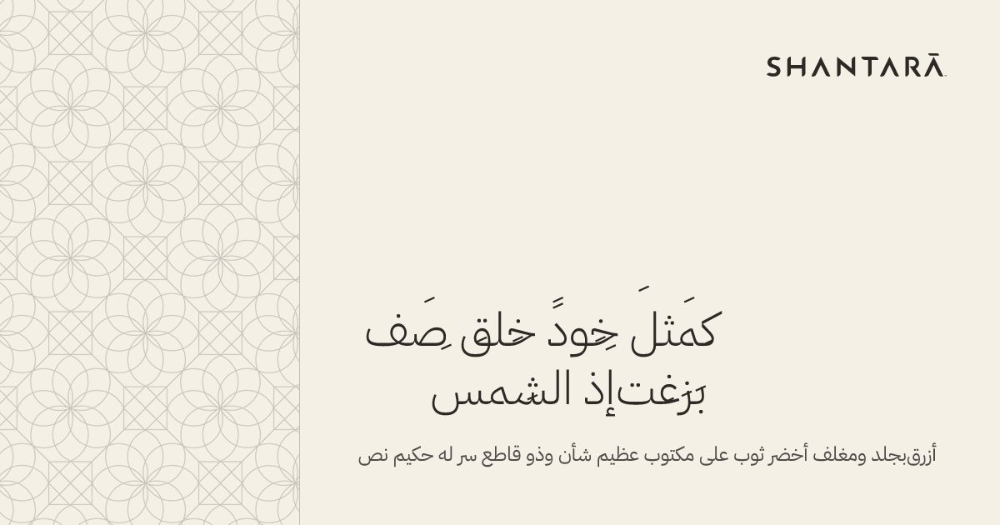

**Before Arabic is enabled**, one of these must be true, confirmed by re-running `npm run samples` and reviewing `samples/rtl-test/`:

- a satori release renders the space and the marks correctly; or
- right-to-left images are rendered at build time in a headless browser (Playwright is already a dev dependency) from the same three layouts. That changes the rendering engine for those locales only; the templates, sizes, rules and checks here stay the same.

Then measure real Arabic titles against each template and set Arabic title limits (the table in section 4 is measured on Diodrum), render `og-default-ar.jpg` from `site/ar.json`, and copy the Arabic TTFs into the website.

**Hindi and Malayalam** need complex shaping (conjuncts, reordered vowel signs) that satori is not known to handle. Choose the typeface first, then run the same test with real titles. Until then, no Hindi or Malayalam page is generated, so none needs a share image.

### Other

| Question | What to do |
| --- | --- |
| Platform image caches | Images keep their URL when a title changes, so platforms can show the old one until re-scraped. Add a content hash to the file name only if this becomes a real problem. |
| Photograph position | Crops are centred. Add a position option only when a real page's photograph cannot be replaced by a better-framed one. |
